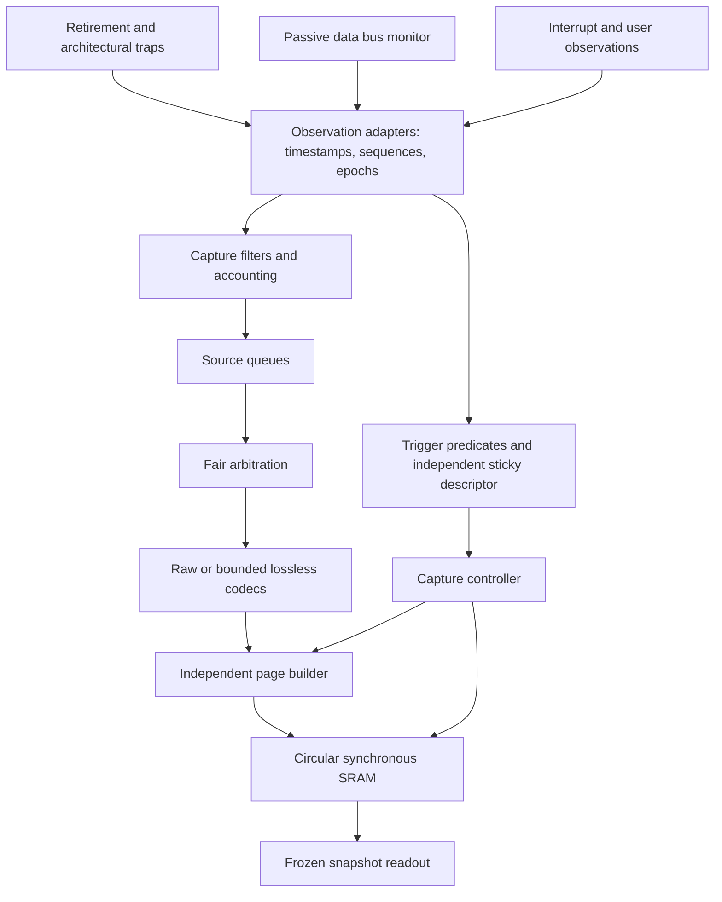

# Chronos architecture

Status: P0 design baseline. No Chronos capture datapath exists yet. This document defines intended behavior; P1 must validate capacity and freeze executable contracts before P2 RTL consumes them. The existing-core candidate is Ibex, but its source has not been acquired and its Chronos adapter remains unqualified.

Chronos records a bounded history of architectural execution and observed SoC transactions around a trigger. Its baseline supports offline investigation of retained evidence. It does not restore historical machine state or provide checkpoint/replay.

## Baseline path

V1 targets one RV32 hart, one retirement lane, one capture clock, a simple data request/response bus, and a workload containing only 32-bit instructions. Development starts in simulation because no physical FPGA board is currently available; a simulation preview does not close the physical V1 gate. The imported core's actual ISA is documented separately. Observing a shorter instruction must explicitly mark or stop an unsupported profile; it cannot silently use a four-byte PC step.

Adapters observe the SoC without controlling CPU stalls or bus handshakes. Internal queues may use backpressure, but no trace-ready signal may propagate into observed logic. Additional routing load still affects timing and power and requires separate measurement.

Observation lanes must cover every supported same-cycle combination, including retirement, trap/accepted interrupt, bus request/completion, pending interrupt changes, and user events. One source identity need not mean one physical input lane. An exception without retirement is legal. Core-specific simultaneous-event ordering remains a qualification decision.

## Time, order, and codecs

Assign source sequence, epoch, and timestamp at the stated observation boundary before filtering or queue admission. Arbitration changes delivery order, not observation time. In V1, same-tick events are simultaneous; deterministic source/lane sorting is a presentation rule.

Keep raw encoding as the reference. Delta and PC-run encoding must reconstruct every preserved field and exact retirement time. A PC run requires compatible instruction length, consecutive source sequences, fixed timestamp stride, and unchanged architectural boundary context. Each implicit retirement, including the last, must have sequential next PC. A changed destination is encoded explicitly.

A retirement-side execution-boundary epoch or barrier ends runs at traps and accepted interrupts even when their separate event records are delayed or dropped. Flush runs at page boundaries, losses, epoch changes, incompatible timing, maximum count/age, and capture completion.

## Storage and loss

Every exported page is independently decodable. It restarts per-source codec state with the absolute information needed locally. Records cannot cross pages or depend on overwritten history. A directory publishes a page only after its payload and header are complete; invalidate an old entry before reclaiming storage.

P1 sizing hypotheses are 32 KiB trace SRAM, 1 KiB pages, 64-byte headers, a 128-byte maximum record, 16 queue entries per source, and a 64-bit memory write path. These values are not frozen, a measured throughput result, or a lossless input guarantee. Directory, trigger, journal, FIFO, and pipeline storage are additional resources.

Initially evaluate 16 prehistory pages and 16 reserved post pages. Four queues of 16 maximum-size records already require 8,192 bytes before pipeline, restart, padding, and terminal overhead. Eight pages with 960 payload bytes each cannot contain that backlog. P1 must enumerate actual lane/bundle expansion and reserve sufficient space under worst-case encoding.

Admission after triggering must maintain:

`remaining post payload >= completion bytes for all admitted work + final metadata + padding/restart allowance`

At trigger, pin committed prehistory and stop reclaiming it. An active unpublished prehistory page may finish once and become pinned. New pages use the reserved pool. Queued pre-trigger events may occupy post pages; storage allocation does not change their timestamps.

Distinguish intentional filtering, ingress loss, downstream discard, ring eviction, and corrupt/truncated input. Preserve finite loss-journal storage and sticky overflow status separately from ordinary queues. Aggregate counts cannot classify each individual sequence gap: uncertain ranges remain unknown or mixed. Any affected codec restarts before resuming reconstruction.

## Capture lifecycle

The proposed states are `DISABLED`, `ARMED`, `POST_TRIGGER`, `DRAINING`, `FROZEN`, and `CLEARING`.

1. Validate and atomically apply configuration while disabled or frozen. Arm starts a new session epoch and resets session accounting.
2. Evaluate triggers before filtering and admission. Latch the first trigger in separate storage, combine simultaneous reasons in a mask, and use a documented priority for its primary event.
3. Preserve retained prehistory and admit a bounded observation-time post window. Window completion, capacity exhaustion, and host stop have distinct terminal reasons.
4. Stop new admission, flush bounded codecs, finish admitted records, seal pages, and publish an immutable snapshot. A finite drain timeout exposes an incomplete result.
5. Repeated frozen reads return the same snapshot identity, directory, and bytes. Clear deliberately scrubs storage before releasing it; reads never implicitly rearm or clear.

The zero-cycle post window includes eligible trigger-cycle observations under the eventual lane contract and drains already admitted work. Trigger status survives ordinary congestion even if the triggering event's record is missing.

## Integration and future boundaries

Start disabled, make data-value capture opt-in, and support a platform authorization input. A prototype lock is not secure debug authentication. Readout/configuration traffic must be excluded or explicitly classified to avoid self-observation. Session validity must guard SRAM access.

Separate CPU/source reset from trace reset where the platform permits. Source reset changes its epoch and invalidates codec/transaction context; trace reset invalidates the session unless a separately qualified retention design exists. Full power loss is outside V1 retention. Frozen readout should remain usable when firmware halts.

V2 adds qualified AXI4 association, real DMA/cache hooks, and asynchronous source domains. CDC wrappers remain separate from the synchronous baseline. Later domain-local counters cross with whole records through asynchronous FIFOs; coherent synchronization samples yield bounded time intervals. Overlapping intervals remain ambiguous, stopped clocks cannot block bounded freeze, and clock/reset changes invalidate correlation until recovered.

V3 adds multiple harts and a selected, independently qualified standard trace profile. Custom Chronos events retain their own protocol identifier. Optional DDR streaming needs separate bandwidth/interference evidence. ASIC work uses an explicit synchronous SRAM contract and reports logic-only, SRAM-backed, and signoff evidence separately.

See [interfaces](interfaces.md), [requirements](requirements.md), [verification](verification.md), and the [baseline decision](adr/0001-baseline.md).
